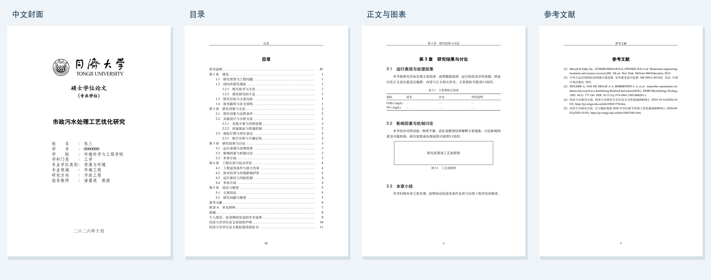

<p align="center">
  
</p>

<p align="center">
  <a href="https://www.overleaf.com/docs?snip_uri=https%3A%2F%2Fgithub.com%2Feggpig%2FTongjiEnvThesis%2Freleases%2Flatest%2Fdownload%2FTongjiEnvThesis-Overleaf.zip&amp;engine=xelatex&amp;main_document=main.tex"></a>
  <a href="https://github.com/eggpig/TongjiEnvThesis/releases/latest"></a>
  <a href="https://github.com/eggpig/TongjiEnvThesis/actions/workflows/build.yml"></a>
  <a href="LICENSE"></a>
</p>

同济大学环境科学与工程学院**资源与环境专业硕士**论文 LaTeX 模板，提供市政工程方向的示例章节。采用研究生院 2025 年 10 月写作指南，支持 **XeLaTeX、GB/T 7714—2015、BibTeX / Biber**。这是社区维护的非官方模板。

<p align="center">
  
</p>

## 开始使用

1. 点击 **[Open in Overleaf](https://www.overleaf.com/docs?snip_uri=https%3A%2F%2Fgithub.com%2Feggpig%2FTongjiEnvThesis%2Freleases%2Flatest%2Fdownload%2FTongjiEnvThesis-Overleaf.zip&engine=xelatex&main_document=main.tex)**，建立自己的项目；也可在 [Releases](https://github.com/eggpig/TongjiEnvThesis/releases/latest) 下载 `TongjiEnvThesis-Overleaf.zip`，在 Overleaf 选择 **New project → Upload project**。
2. 在 `metadata.tex` 填写中英文题目、姓名、导师与专业信息，在 `chapters/` 和 `frontmatter/` 写正文与摘要，在 `references/references.bib` 管理文献。
3. 使用 **XeLaTeX** 编译 `main.tex`。示例姓名为张三、导师为诸葛亮；专业字段按本人学籍及入学当年培养方案填写。

| 文件 | 内容 |
| --- | --- |
| `metadata.tex` | 中英文封面信息 |
| `frontmatter/` | 摘要、符号说明 |
| `chapters/` | 绪论、方法、结果、工程应用、结论 |
| `references/references.bib` | 文献库 |
| `backmatter/` | 附录、致谢、简历、声明 |
| `signed/` | 正式签名页、纸质稿答辩决议 |

## 输出版本

在 Overleaf 的项目设置中切换 **Main document** 即可。各入口共用正文，无需重复修改。

| 入口 | 用途 | 示例 PDF |
| --- | --- | --- |
| `main.tex` | 电子正式版 | [预览](https://github.com/eggpig/TongjiEnvThesis/releases/latest/download/TongjiEnvThesis.pdf) |
| `blind.tex` | 隐名版：隐藏封面身份字段、致谢、简历与签名页，清空 PDF 作者 | [预览](https://github.com/eggpig/TongjiEnvThesis/releases/latest/download/TongjiEnvThesis-Blind.pdf) |
| `print.tex` | 双面打印版：封面背页补白，可附纸质答辩决议 | [预览](https://github.com/eggpig/TongjiEnvThesis/releases/latest/download/TongjiEnvThesis-Print.pdf) |
| `spine.tex` | 单独的书脊文字页 | [预览](https://github.com/eggpig/TongjiEnvThesis/releases/latest/download/TongjiEnvThesis-Spine.pdf) |
| `biber.tex` | 使用 Biber 的正式版 | 与 `main.tex` 共用内容 |

隐名送审时，同时检查正文、图片、附录、自引与文件名中的身份信息。签名页的替换方式见 [signed/README.md](signed/README.md)。

## 字体

默认使用 TeX Live 自带的 **Fandol / TeX Gyre**，无需上传字体即可编译。正式提交稿请按 [字体配置](fonts/README.md) 放入学校指定字体，然后设置：

```latex
\documentclass[fontset=school]{tongji-env-master}
```

开源字体与学校指定字体的字形不同，封面隶书在开源模式中由楷体替代；页面尺寸、字号与行距使用相同配置。

## 参考文献

默认使用 BibTeX。切换到 `biber.tex` 即使用 Biber；也可在 `main.tex` 设置 `bibbackend=biber`。两种后端都采用 **GB/T 7714—2015 顺序编码制**：按首次引用排序，正文方括号上标，连续编号自动压缩。

```latex
研究结论的相应表述\supercite{mulder1995}。
多篇文献的共同结论\supercite{metcalf2014,gb50014,mulder1995}。
指定引用页码\supercite[177--179]{mulder1995}。
```

```bibtex
@article{mulder1995,
  author  = {Mulder, A. and van de Graaf, A. A. and Robertson, L. A. and Kuenen, J. G.},
  title   = {Anaerobic ammonium oxidation discovered in a denitrifying fluidized bed reactor},
  journal = {FEMS Microbiology Ecology},
  year    = {1995},
  volume  = {16},
  number  = {3},
  pages   = {177--184},
  doi     = {10.1111/j.1574-6941.1995.tb00281.x}
}
```

作者之间用 `and` 分隔；机构作者使用双层花括号。文献库内另有图书、标准与网页的示例，未引用条目不会进入文献表。

## 本地编译

使用 TeX Live 2026 或具备相应宏包的较新 TeX Live / MacTeX：

```bash
latexmk -xelatex -halt-on-error -outdir=build main.tex
# 或使用 Makefile
make main
make blind
make biber
```

`latexmk` 自动处理文献与交叉引用。GitHub Actions 编译五个入口并检查缺字、未定义引用与排版溢出。[构建核验](docs/validation.md)记录已测试版本与编译用时。

## 格式依据与贡献

[格式依据](docs/format.md)列出当前学校、学院公开文件与排版参数，核对日期为 **2026-10-03**。2025 级培养方案用于示例专业字段，其他年级使用其适用方案。

欢迎通过 [Issues](https://github.com/eggpig/TongjiEnvThesis/issues) 提交格式问题，附所依据的学校文件及最小示例；改进可提交 Pull Request。

感谢 [wyqy/TongjiThesis_Proto](https://github.com/wyqy/TongjiThesis_Proto)、[marquistj13/TongjiThesis](https://github.com/marquistj13/TongjiThesis)、[TJ-CSCCG/TongjiThesis](https://github.com/TJ-CSCCG/TongjiThesis) 及同济 LaTeX 社区。模板代码采用 [MIT License](LICENSE)，素材与依赖说明见 [NOTICE.md](NOTICE.md)。
